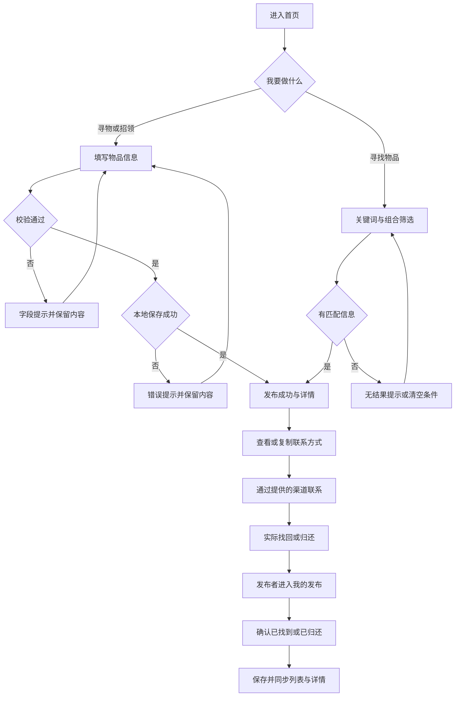
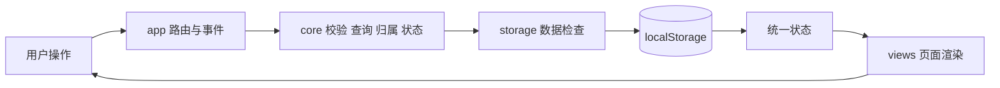
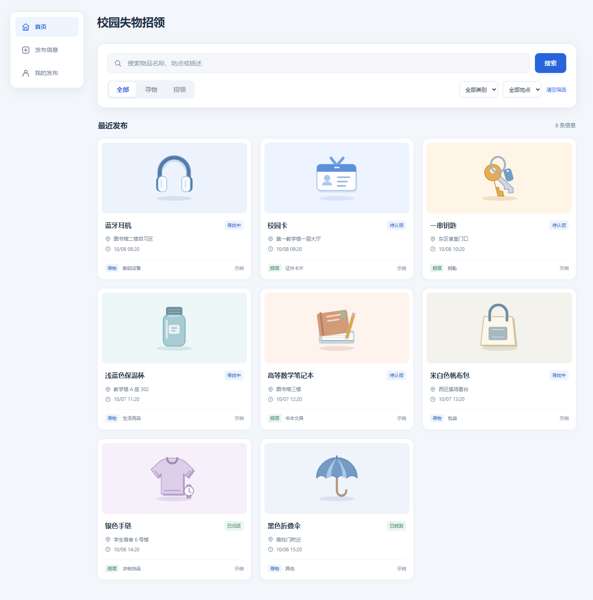

# 从原型到程序：校园失物招领 Web 实现

> 本文是基于实际实现和测试生成的博客草稿。仓库、功能和测试内容可据实使用；两人博客链接、人工工时、实际协作与互评尚未提供，提交前由本人补齐，不能把草稿当作已完成的结对经历。

| 项目 | 内容 |
|---|---|
| 所属课程 | [2026 软件工程](https://edu.cnblogs.com/campus/fzu/202601SofwareEngineering/) |
| 本次要求 | 见仓库 requirement.md；老师发布的本次作业页面链接由本人补齐 |
| 作业目标 | 基于上一轮原型，完成校园失物招领核心程序、测试与报告 |
| 成员 | 102401309 叶凯乐；102401234 黄俊凡 |
| 结对同学博客、本次博客链接 | 尚未提供，发布前补齐真实链接 |
| GitHub | [项目仓库](https://github.com/cht-hyp/campus-lost-and-found) |

## 一、分工与 PSP

计划沿用上一轮分工方向：黄俊凡负责页面、样式和交互；叶凯乐负责业务、搜索、存储和测试；共同复核需求、互审和撰写博客。**当前代码为工具辅助实现，实际两人完成情况需要本人填写。**

开发前已填写 500 分钟的人工作业预算，按计划、分析、设计、编码、测试与报告分解，完整表格见 [PSP](psp.md)。真实人工耗时、差异和原因仍需两位成员各自计时后补齐。本次辅助执行的阶段证据单独记录，不冒充人工 PSP。

| PSP2.1 阶段 | 预估（分钟） | 实际人工耗时（分钟） |
|---|---:|---|
| 计划与估时 | 20 | 待本人填写 |
| 需求分析与技术学习 | 35 | 待本人填写 |
| 设计文档 | 25 | 待本人填写 |
| 设计复审 | 10 | 待本人填写 |
| 代码规范 | 10 | 待本人填写 |
| 页面与数据设计 | 35 | 待本人填写 |
| 编码 | 180 | 待本人填写 |
| 代码复审 | 30 | 待本人填写 |
| 测试与修复 | 80 | 待本人填写 |
| 测试报告与博客 | 45 | 待本人填写 |
| 工作量统计 | 10 | 待本人填写 |
| 总结与改进 | 20 | 待本人填写 |
| **合计** | **500** | **待两人真实记录** |

## 二、解题思路与设计实现

本次选择 Web 路线，优先保证老师要求的“下载后用 Chrome 打开 HTML”能运行。采用原生 HTML、CSS 和 JavaScript，通过 localStorage 保存本机记录，避免引入服务器与数据库。以原型的蓝白配色为基础，2026-10-09 将桌面布局调整为左侧导航与三列图文卡片，中等宽度双列，手机单列并保留底部导航；宽屏发布页将图片与资料分区，详情页将联系方式单独呈现。界面只保留功能相关内容。

核心流程是发布信息、浏览或搜索、查看详情、通过提供的联系方式联系，以及由发布者结束信息。延续原型中的“我的发布”和编辑功能。不同设备不共享数据，浏览器匿名标识只是本机演示的归属判断。

### 核心流程图



### 数据流图



### 关键实现：一份数据管理状态

原型曾使用不同页面表示状态，切换页面可能重新出现旧状态。程序中每条记录只保存 `open` / `resolved`，根据寻物或招领类型显示“寻找中 / 已找到”或“待认领 / 已归还”。所有页面读取同一组记录，编辑不重置状态。

`core.js` 的完成操作先验证发布者，再返回新记录；已完成时保留原完成时间：

```javascript
function resolvePost(post, ownerId, now = new Date()) {
  assertOwner(post, ownerId);
  if (post.status === 'resolved') return { ...post };
  return { ...post, status: 'resolved', updatedAt: now.toISOString() };
}
```

`app.js` 中每次变更先读取最新存储，保存成功后才替换页面状态。这样存储异常不会造成“页面显示成功，刷新后却丢失”的假象：

```javascript
function commit(changePosts) {
  const latest = repository.load();
  const next = { ...latest, posts: changePosts(latest.posts, latest.ownerId) };
  repository.save(next);
  state = next;
}
```

表单必填内容、空格、长度和时间由独立函数校验，错误显示在对应字段旁。用户输入转义后进入模板，避免把描述中的 HTML 当成代码。浏览器后退通过历史索引恢复取消离开前的 URL，表单 DOM 保留，不丢失尚未保存的内容。

## 三、附加特点

### 类别与地点组合筛选

物品名称可能重复，类别与地点能进一步缩小范围。类型、类别、地点与关键词采用交集；地点允许匹配具体位置中的区域名称。例如选择“数码设备 + 图书馆”，仍可找到地点为“图书馆二楼”的记录。

核心判断位于 `core.js`，每个条件为空时不限制结果；多个条件都满足才保留。测试同时验证匹配与无匹配的交集，不只演示一条顺利路径。

### 一键复制联系方式

减少手动抄录 QQ、微信或手机号的错误。只在 `clipboard.writeText` 真正成功后提示已复制；没有权限或 API 时提供选中文本的弹窗：

```javascript
async function copyContact(value, clipboard) {
  try {
    if (!clipboard || typeof clipboard.writeText !== 'function')
      throw new Error('Clipboard unavailable');
    await clipboard.writeText(value);
    return { copied: true };
  } catch (_) {
    return { copied: false, text: value };
  }
}
```




## 四、目录与使用说明

根目录 `index.html` 是入口；`css` 保存响应式样式；`js` 按业务、存储、示例、工具、视图和事件分工，图标为代码内置 SVG；`tests` 保存单元测试；`artifacts` 保存实际截图和输出；`docs` 保存设计与报告材料。

测试人员下载并解压整个仓库，用 Chrome 打开 `index.html`，无需 Node 或服务器。开发者运行 `npm test` 时才需要 Node。详细步骤、数据边界与异常处理见 [README](../README.md)。

## 五、单元测试

选择 Node 内置 `node:test` 与 `assert/strict`，不用另装测试框架。以白盒分支为基础，结合正常等价类、异常等价类和边界值设计 74 个用例。先运行缺少实现的失败测试，再实现并验证通过。

例如，测试正常寻物、正常招领；对每个必填字段分别测试空格；用 2 月 30 日与未来时间区分日期错误；查询分别匹配名称、地点、描述，并验证组合条件；管理覆盖本人 / 他人和首次 / 重复完成；存储覆盖损坏及读写拒绝。

```javascript
test('他人不能编辑记录', () => {
  assert.throws(() => Core.editPost(post(), valid, 'other', now),
    error => error.code === 'FORBIDDEN');
});
```

`post()`、`valid` 和 `now` 是测试文件中的完整固定样本，预期行为不由业务函数生成。自动化结果为 74 / 74 通过，加载的四个模块总行覆盖率 86.00%、分支覆盖率 89.76%。图片解码与压缩由真实 Chrome 检查，完整结果见 [测试报告](test-report.md)，包含数据设计、范围限制及原始证据。

## 六、GitHub 提交记录

项目按设计预估、业务逻辑、持久化和页面验收分别提交。可在仓库 Commits 查看真实记录。**提交博客前，需要两位成员补充 GitHub 页面截图及实际 fork / PR 记录。** 操作说明见 [协作清单](github-collaboration.md)，不生成虚假的另一位作者或提交时间。

## 七、实际问题与解决

1. **页面状态一致性：** 原型已经暴露过页面切换后状态恢复的问题。实现改用统一记录和类型 / 状态映射，并验证完成、编辑、列表、详情及刷新后的结果。
2. **浏览器能力失败：** 不能假设本地存储和剪贴板永远可用。增加读取、保存、损坏数据和复制权限的失败分支；保存失败保留表单，损坏数据不静默覆盖，复制失败提供人工操作。
3. **验收脚本的选择器冲突：** 联系方式输入框与隐藏弹窗具有相似可访问名称，首次自动验收发生严格匹配错误。定位到测试范围过宽，限定到发布表单后继续走查，全流程通过。这个问题属于实际工具辅助测试过程，不冒充两人的结对困难。
4. **连续取消导航：** 在快速取消离开、随后后退时，旧 dialog 的异步 close 事件可能清理下一次弹窗的按钮。通过浏览器事件记录确认原因，改为在按钮或 Escape 操作时立即完成当前确认，再验证取消后表单、URL 和按钮正常。

两位成员在实际阅读、修改和协作中遇到的问题，还需本人补充事实、尝试、结果和收获。

## 八、队友评价与总结

这部分必须由两位成员根据真实合作分别填写：值得学习的具体行为、需要改进的地方，以及下一次如何调整分工或估时。当前没有这些事实，不能代写成已经发生的经历。

已实现程序说明了原型走查和真实数据逻辑的区别：不仅要展示顺利路径，还要处理状态维护、保存失败、空结果和取消操作。后续人工试用应记录实际反馈，再决定是否扩展为多人共享系统。
