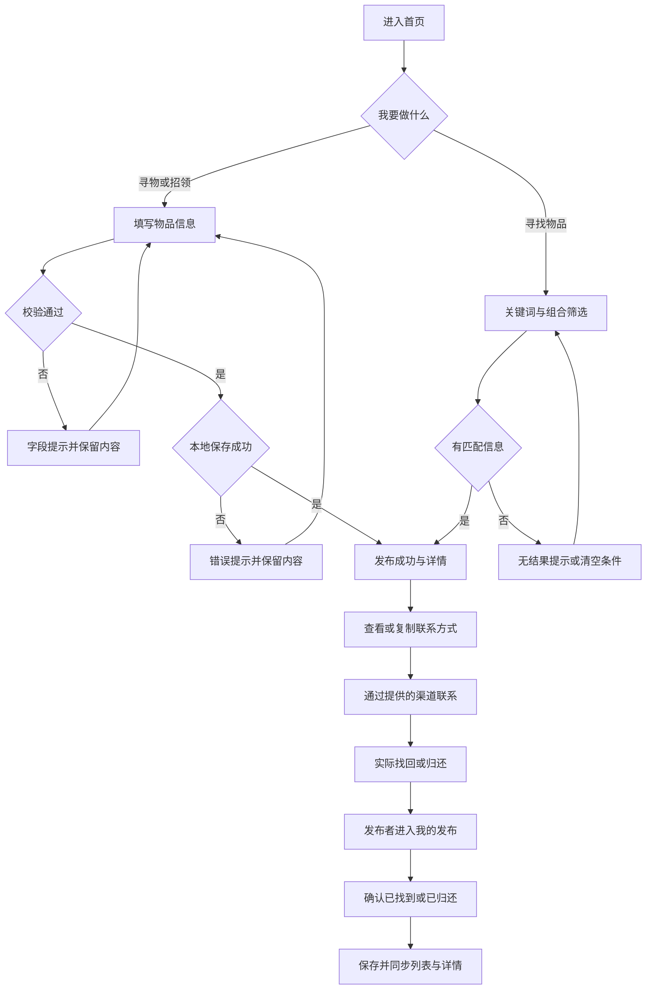
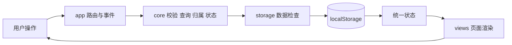
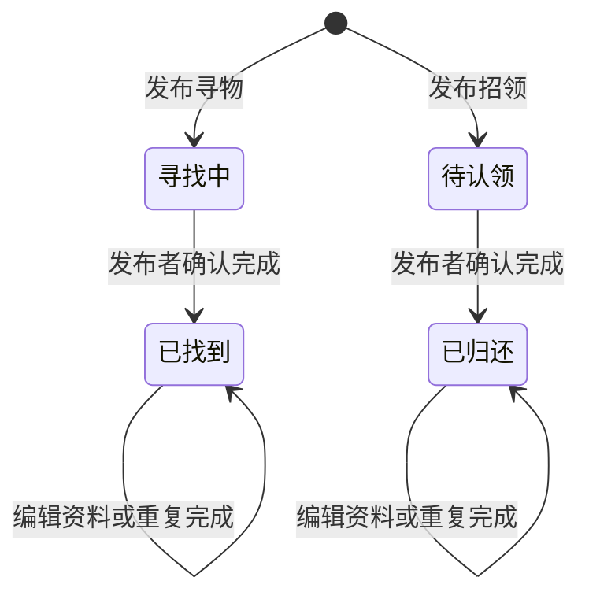

# 从原型到程序：校园失物招领 Web 实现

> 本文记录校园失物招领 Web 的实际实现。技术正文、代码和测试结果已整理完成；标记为“待补充”的个人信息、人工工时、分工完成情况与队友评价，需在发布前据实填写。开发和整理过程中使用了 AI 辅助工具。

| 项目 | 内容 |
|---|---|
| 所属课程 | [2026 软件工程](https://edu.cnblogs.com/campus/fzu/202601SofwareEngineering/) |
| 本次要求 | [requirement.md](https://github.com/cht-hyp/campus-lost-and-found/blob/main/requirement.md)；本次作业页面链接：待补充 |
| 作业目标 | 基于上一轮原型，完成校园失物招领核心程序、测试与报告 |
| 成员 | 102401309 叶凯乐；102401234 黄俊凡 |
| 叶凯乐的博客 | 待补充 |
| 黄俊凡的博客 | 待补充 |
| 本篇作业博客链接 | 待补充（发布后填写） |
| GitHub | [项目仓库](https://github.com/cht-hyp/campus-lost-and-found) |

本文对应 2026-10-09 的改版，程序提交为 `fa18651`，位于 `codex/layout-refresh` 分支及 [PR #1](https://github.com/cht-hyp/campus-lost-and-found/pull/1)。整理本文时 PR 为草稿，尚未合并到 `main`；复现下方新版截图时应下载该分支。

## 程序完成情况

| 要求 | 实现与验证 |
|---|---|
| 发布寻物、发布招领 | 同一表单切换类型，必填校验，保存成功后进入详情 |
| 浏览和关键词搜索 | 首页列表，关键词匹配名称、地点和描述 |
| 查看详情与联系方式 | 卡片进入详情，可查看完整资料并复制联系方式 |
| 发布者更新状态 | 寻物变为“已找到”，招领变为“已归还”，编辑不重置状态 |
| Chrome 直接打开 HTML | 无构建、服务器或运行依赖，真实 Chrome 离线验收通过 |
| README、目录与操作说明 | 已提供，下面同时给出复现步骤 |
| 自动化单元测试 | 74 项通过，覆盖有效输入、异常输入、归属、状态与存储分支 |
| 附加特点 | 重点展示组合筛选与一键复制，补充照片上传和离开提醒 |

本次实现是本机演示版本：信息保存在当前浏览器的 localStorage 中，不同设备不共享。发布者身份由本地匿名标识区分，没有真实账号认证；认领与归还通过发布者留下的联系方式在线下沟通，再由发布者更新状态。这一范围与题目“不要求复杂后台、实名认证、即时聊天和地图定位”的约定相符。

## 一、分工与 PSP

计划沿用上一轮分工方向：黄俊凡负责页面、样式和交互；叶凯乐负责业务、搜索、存储和测试；共同复核需求、互审和撰写博客。**当前代码为工具辅助实现，实际两人完成情况需要本人填写。**

| 成员 | 计划负责内容 | 实际完成内容与对应提交 |
|---|---|---|
| 黄俊凡 | 页面、响应式样式、交互、截图 | 待补充 |
| 叶凯乐 | 业务逻辑、筛选、存储、测试 | 待补充 |
| 共同 | 需求复核、互审、人工试用、博客 | 待补充 |

开发前已填写 500 分钟的人工作业预算，按计划、分析、设计、编码、测试与报告分解，完整表格见 [PSP](https://github.com/cht-hyp/campus-lost-and-found/blob/codex/layout-refresh/docs/psp.md)。真实人工耗时、差异和原因仍需两位成员各自计时后补齐。本次辅助执行的阶段证据单独记录，不冒充人工 PSP。

| PSP2.1 阶段 | 预估（分钟） | 实际人工耗时（分钟） |
|---|---:|---|
| 计划与估时 | 20 | 待本人填写 |
| 需求分析与技术学习 | 35 | 待本人填写 |
| 设计文档 | 25 | 待本人填写 |
| 设计复审 | 10 | 待本人填写 |
| 代码规范 | 10 | 待本人填写 |
| 页面与数据设计 | 35 | 待本人填写 |
| 编码 | 180 | 待本人填写 |
| 代码复审 | 30 | 待本人填写 |
| 测试与修复 | 80 | 待本人填写 |
| 测试报告与博客 | 45 | 待本人填写 |
| 工作量统计 | 10 | 待本人填写 |
| 总结与改进 | 20 | 待本人填写 |
| **合计** | **500** | **待两人真实记录** |

实际耗时填写后，应另外解释差异：哪一阶段超出预估、具体返工了什么、下一次如何调整估算。已知的改版和导航修复可作为讨论线索，但不能直接把工具运行时间填成人工耗时。

## 二、解题思路与设计实现

本次选择 Web 路线，优先保证老师要求的“下载后用 Chrome 打开 HTML”能运行。采用原生 HTML、CSS 和 JavaScript，通过 localStorage 保存本机记录，避免引入服务器与数据库。以原型的蓝白配色为基础，2026-10-09 将桌面布局调整为左侧导航与三列图文卡片，中等宽度双列，手机单列并保留底部导航；宽屏发布页将图片与资料分区，详情页将联系方式单独呈现。界面只保留功能相关内容。

核心流程是发布信息、浏览或搜索、查看详情、通过提供的联系方式联系，以及由发布者结束信息。延续原型中的“我的发布”和编辑功能。不同设备不共享数据，浏览器匿名标识只是本机演示的归属判断。

### 核心流程图



### 数据流图



### 关键实现：一份数据管理状态

一条记录包含 `id`、`ownerId`、`type`、`status`、`title`、`category`、`location`、`occurredAt`、`description`、`contact`、可选 `image`，以及创建和更新时间。`id` 用于详情定位；`ownerId` 用于“我的发布”和管理检查；`type` 与 `status` 共同决定展示的状态文字。



原型曾使用不同页面表示状态，切换页面可能重新出现旧状态。程序中每条记录只保存 `open` / `resolved`，根据寻物或招领类型显示“寻找中 / 已找到”或“待认领 / 已归还”。所有页面读取同一组记录，编辑不重置状态。

`core.js` 的完成操作先验证发布者，再返回新记录；已完成时保留原完成时间：

```javascript
function resolvePost(post, ownerId, now = new Date()) {
  assertOwner(post, ownerId);
  if (post.status === 'resolved') return { ...post };
  return { ...post, status: 'resolved', updatedAt: now.toISOString() };
}
```

`app.js` 中每次变更先读取最新存储，保存成功后才替换页面状态。这样存储异常不会造成“页面显示成功，刷新后却丢失”的假象：

```javascript
function commit(changePosts) {
  const latest = repository.load();
  const next = { ...latest, posts: changePosts(latest.posts, latest.ownerId) };
  repository.save(next);
  state = next;
}
```

表单必填内容、空格、长度和时间由独立函数校验，错误显示在对应字段旁。用户输入转义后进入模板，避免把描述中的 HTML 当成代码。浏览器后退通过历史索引恢复取消离开前的 URL，表单 DOM 保留，不丢失尚未保存的内容。

## 三、附加特点

发布、关键词搜索、详情和完成状态属于题目规定的核心功能，不重复计作附加特点。下面前两项直接对应评分规则中的示例；照片和离开提醒作为补充体验展示，最终得分以实际验收为准。

### 类别与地点组合筛选

物品名称可能重复，类别与地点能进一步缩小范围。类型、类别、地点与关键词采用交集；地点允许匹配具体位置中的区域名称。例如选择“数码设备 + 图书馆”，仍可找到地点为“图书馆二楼”的记录。

核心判断位于 `core.js`，每个条件为空时不限制结果；多个条件都满足才保留。测试同时验证匹配与无匹配的交集，不只演示一条顺利路径。

实际实现如下。`filter` 内各组条件用 `&&` 连接，因此不会把“符合类别”但“不符合地点”的记录混入结果；关键词内部使用 `some`，表示名称、地点、描述任一匹配即可。

```javascript
function filterPosts(posts, filters = {}) {
  const keyword = text(filters.keyword).toLocaleLowerCase();
  const location = text(filters.location).toLocaleLowerCase();
  return posts
    .filter((post) =>
      (!filters.type || filters.type === 'all' || post.type === filters.type) &&
      (!filters.category || post.category === filters.category) &&
      (!location || post.location.toLocaleLowerCase().includes(location)) &&
      (!filters.ownerId || post.ownerId === filters.ownerId) &&
      (!keyword || [post.title, post.location, post.description].some(
        (value) => value.toLocaleLowerCase().includes(keyword)
      ))
    )
    .sort((a, b) => Date.parse(b.createdAt) - Date.parse(a.createdAt));
}
```

复现：选择“数码设备”和“图书馆”，点击“搜索”。示例中的蓝牙耳机保留，校园卡和钥匙被排除；点击“清空筛选”可恢复列表。


### 一键复制联系方式

减少手动抄录 QQ、微信或手机号的错误。只在 `clipboard.writeText` 真正成功后提示已复制；没有权限或 API 时提供选中文本的弹窗：

```javascript
async function copyContact(value, clipboard) {
  try {
    if (!clipboard || typeof clipboard.writeText !== 'function')
      throw new Error('Clipboard unavailable');
    await clipboard.writeText(value);
    return { copied: true };
  } catch (_) {
    return { copied: false, text: value };
  }
}
```

复现：进入任一物品详情，点击“复制联系方式”。支持写入时提示成功；浏览器拒绝时弹出手动复制框，选中内容后可以 Ctrl+C 或长按复制。截图中的失败分支是在隔离测试浏览器中主动禁用剪贴板 API 后获得的。


### 补充：照片上传与类别默认图片

物品外观通常比名称更容易辨认。发布寻物、招领或编辑时，可以选择 JPG、PNG、WebP 照片；不上传时，根据所选类别展示内置 SVG 插画，避免卡片空白。照片可预览、更换和移除，列表与详情使用同一份图片数据。

图片先检查类型、大小和像素数量，再在浏览器中等比缩小和压缩：原图最大 10 MB、2400 万像素，最长边不超过 1200 像素。压缩后的 JPEG 数据长度控制在 360000 字符以内，尽量减少本地存储占用；存储仍可能不足，此时保留表单并提示失败。

```javascript
function fitDimensions(width, height, maxSide = 1200) {
  if (![width, height, maxSide].every((n) => Number.isFinite(n) && n > 0))
    throw new Error('图片尺寸不正确');
  const scale = Math.min(1, maxSide / Math.max(width, height));
  return {
    width: Math.max(1, Math.round(width * scale)),
    height: Math.max(1, Math.round(height * scale))
  };
}
```

这里使用同一个缩放比例，避免把照片拉伸变形；比例最大为 1，也不会无意义地放大小图。


### 补充：未保存离开提醒

填写中点击导航、取消或使用浏览器后退，会先检查表单是否变化。选择“继续编辑”后保留输入和图片；只有确认放弃才切换页面。图片处理尚未结束也算未保存内容，防止压缩完成后把旧图片写进另一张新表单。

### 界面展示

桌面采用侧栏和三列图文卡片，减少图片、地点、状态混在一起的情况；中等宽度改为双列，手机保留底部导航和单列。页面仅展示操作所需信息，没有宣传横幅和装饰性文案。


## 四、目录与使用说明

根目录 `index.html` 是入口；`css` 保存响应式样式；`js` 按业务、存储、示例、工具、视图和事件分工，图标为代码内置 SVG；`tests` 保存单元测试；`artifacts` 保存实际截图和输出；`docs` 保存设计与报告材料。

```text
index.html                  网页入口
css/styles.css              桌面、平板和手机样式
js/core.js                  校验、搜索、归属、状态规则
js/storage.js               localStorage 读写及异常保护
js/seed.js                  示例物品
js/ui.js                    路由工具、转义、剪贴板及 SVG 插画
js/images.js                图片检查、缩放与压缩
js/views.js                 页面模板
js/app.js                   路由、事件、表单与状态同步
tests/*.test.cjs            业务、存储、图片工具及 UI 工具测试
scripts/browser-check.cjs   Chrome 离线流程验收
scripts/layout-check.cjs    多宽度布局检查
artifacts/                  真实截图和测试报告
docs/                      设计、PSP、博客与协作说明
README.md                  运行与使用说明
```

### 下载和运行

1. 打开 GitHub 仓库，选择 `codex/layout-refresh` 分支，再点 **Code → Download ZIP**。PR 合并后可直接下载 `main`。
2. 解压整个项目，用 Google Chrome 打开 `index.html`。不要只下载 HTML，入口需要同目录下的 `css` 与 `js`。
3. 首页显示 8 条“示例”信息。网页使用者不需要安装 Node、执行 npm install 或启动服务器。
4. 发布一条自己的信息后刷新页面，检查它仍存在；进入“我的发布”，编辑资料并标记完成，再确认列表与详情的状态一致。

| 操作 | 路径 |
|---|---|
| 发布寻物或招领 | 导航“发布信息”→选择类型→填写资料→立即发布 |
| 查找物品 | 首页填写关键词、类别或地点→搜索→点击卡片 |
| 联系发布者 | 详情→查看或复制联系方式→通过对应渠道联系 |
| 编辑资料 | 我的发布→编辑信息→保存修改→确认保存 |
| 结束信息 | 本人详情或我的发布→标记已找到 / 已归还→确认 |

首次访问生成匿名发布者标识。清理浏览器数据会删除本地记录；移动项目目录、更换浏览器或设备可能进入不同存储区域。示例记录不属于当前发布者，不能通过“我的发布”管理。更多异常排查见 [README](https://github.com/cht-hyp/campus-lost-and-found/blob/codex/layout-refresh/README.md)。

## 五、单元测试

选择 Node 内置 `node:test` 与 `assert/strict`，不用另装测试框架。以白盒分支为基础，结合正常等价类、异常等价类和边界值设计 74 个用例。导航问题采用“先复现失败，再修改，再回归”的方式验证修复。

### 从一个断言开始的测试教程

测试由三部分组成：准备固定输入、调用被测函数、断言结果。`test()` 给用例命名，`assert.equal()` 检查单个值，`assert.deepEqual()` 检查对象内容，`assert.throws()` 检查预期异常，异步函数则使用 `async/await` 等待结果。

1. 开发测试安装 Node.js 22 或以上，本次使用 Node 24。
2. 在项目根目录打开终端，执行 `npm test`，自动运行 `tests/*.test.cjs`。
3. 只检查业务逻辑时执行 `node --test tests/core.test.cjs`。
4. 执行 `npm run test:coverage`，查看哪些分支尚未覆盖，再结合实际业务风险补充用例。

下面展示一个可独立理解的归属测试。样本使用固定时间和标识，避免“今天是否已经过期”等环境变化影响预期结果：

```javascript
const test = require('node:test');
const assert = require('node:assert/strict');
const Core = require('../js/core.js');

test('其他发布者不能完成这条记录', () => {
  const record = { id: 'p1', ownerId: 'publisher-a', type: 'lost', status: 'open' };
  assert.throws(
    () => Core.resolvePost(record, 'publisher-b', new Date('2026-10-08T06:00:00Z')),
    (error) => error.code === 'FORBIDDEN'
  );
  assert.equal(record.status, 'open');
});
```

这段教学示例调用真实业务函数，解释异常断言和原记录不变的检查方式；74 项统计对应仓库现有测试，不把文中额外示例另计入数量。学习与调试时，可先把期待的错误码改成错误值观察失败信息，再恢复正确断言，理解测试如何发现偏差。测试工具的个人学习经历：待两位成员补充。

### 白盒分支、边界与异常设计

| 被测分支 | 构造数据 | 预期结果 |
|---|---|---|
| 发布类型 | 完整寻物、完整招领 | 正常创建，初始状态 open |
| 必填字段 | 缺失、空串、纯空格 | 对应字段错误，不生成记录 |
| 输入边界 | 名称 61 字、非字符串联系方式 | 拒绝非法输入 |
| 时间检查 | 不存在的 2 月 30 日、未来时间 | 分别拒绝日期错误和未来日期 |
| 搜索范围 | 仅名称、仅地点、仅描述匹配 | 都能命中 |
| 筛选组合 | 类别匹配但地点不匹配 | 不进入交集结果 |
| 空查询 | 空关键词、完全不匹配 | 前者不限制，后者返回空列表 |
| 管理权限 | 本人、其他标识、不存在的记录 | 仅本人可管理 |
| 状态变更 | 两类信息、重复完成 | 标签正确，重复操作不重写完成时间 |
| 编辑已完成信息 | 完成后修改描述或图片 | 完成状态保留 |
| 存储失败 | 读取拒绝、写入拒绝、损坏 JSON | 显式报错，不静默覆盖原数据 |
| 图片处理 | 非图片、空文件、超大、损坏图片 | 拒绝替换已有图片 |
| 复制分支 | 成功、拒绝、API 缺失 | 仅真正成功时报告已复制 |
| 导航和异步 | 取消后退、压缩中离开 | 保留表单，旧结果不污染新表单 |

例如，测试正常寻物、正常招领；对每个必填字段分别测试空格；用 2 月 30 日与未来时间区分日期错误；查询分别匹配名称、地点、描述，并验证组合条件；管理覆盖本人 / 他人和首次 / 重复完成；存储覆盖损坏及读写拒绝。

```javascript
test('他人不能编辑记录', () => {
  assert.throws(() => Core.editPost(post(), valid, 'other', now),
    error => error.code === 'FORBIDDEN');
});
```

`post()`、`valid` 和 `now` 是测试文件中的完整固定样本，预期行为不由业务函数生成。2026-10-09 重新运行得到 74 / 74 通过；四个被测模块合计行覆盖率 86.00%、分支覆盖率 89.76%。这些比例只针对 Node 加载的模块，不代表整站或 CSS 的覆盖率。

```text
tests 74
pass 74
fail 0
line coverage 86.00%
branch coverage 89.76%
```

`images.js` 的 Node 行覆盖率为 44.29%，主要未覆盖依赖真实浏览器的 Image 和 Canvas。图片解码、压缩、替换、移除和存储失败另由 Chrome 流程验收检查，不能只凭单元测试通过就断言页面无问题。

### 浏览器与布局验收

在开发环境可安装可选测试依赖并执行：

```powershell
npm install --no-save --package-lock=false playwright-core
$env:CHROME_PATH = 'C:\Program Files\Google\Chrome\Application\chrome.exe'
node scripts/browser-check.cjs
node scripts/layout-check.cjs
```

本次 Google Chrome 154.0.8037.99 以独立浏览器上下文、离线模式直接打开本地 HTML：31 项流程检查通过，未捕获脚本错误为 0。布局检查覆盖 320–1920px 的 8 个宽度与 5 个页面，共 40 项通过。

这些测试覆盖主要分支和已发现的问题，但不能替代不同设备、真实照片与实际用户的试用。尤其多人共享、真实账号权限和线上并发不在当前实现范围，也没有作为已验证能力宣传。原始记录见 [测试报告](https://github.com/cht-hyp/campus-lost-and-found/blob/codex/layout-refresh/docs/test-report.md)、[流程结果](https://github.com/cht-hyp/campus-lost-and-found/blob/codex/layout-refresh/artifacts/browser-results.json)、[布局结果](https://github.com/cht-hyp/campus-lost-and-found/blob/codex/layout-refresh/artifacts/layout-results.json)。

## 六、GitHub 提交记录

项目按设计预估、业务逻辑、持久化、图片功能及页面调整分别提交。以下为实际历史中的代表性节点：

| 提交 | 内容 |
|---|---|
| `28aa5be` | 设计约定、实现计划与 PSP 预估 |
| `b94c101` | 校验、搜索、归属和状态规则 |
| `70364e3` | 浏览器持久化与异常保护 |
| `e97be06` | 离线网页核心流程 |
| `0c98c0c` | 可选照片与类别插画 |
| `7f7aaaa` | 修正保温杯插画对齐 |
| `28cf3d8` | 修复同路由历史位置同步 |
| `fa18651` | 响应式布局和导航改版 |


截图采自 GitHub 的 `codex/layout-refresh` 分支提交页面，记录截至 `fa18651`，不包含随后保存本文的提交。完整历史见 [Commits](https://github.com/cht-hyp/campus-lost-and-found/commits/codex/layout-refresh/)。

当前 [PR #1](https://github.com/cht-hyp/campus-lost-and-found/pull/1) 是主仓库内的改版草稿，不等同于另一位同学从 fork 发起的贡献。**同伴 fork 地址、本人修改说明和实际 PR 链接：待补充。** 具体操作见 [协作清单](https://github.com/cht-hyp/campus-lost-and-found/blob/codex/layout-refresh/docs/github-collaboration.md)。

## 七、实际问题与解决

1. **页面状态一致性：** 原型已经暴露过页面切换后状态恢复的问题。实现改用统一记录和类型 / 状态映射，并验证完成、编辑、列表、详情及刷新后的结果。
2. **浏览器能力失败：** 不能假设本地存储和剪贴板永远可用。增加读取、保存、损坏数据和复制权限的失败分支；保存失败保留表单，损坏数据不静默覆盖，复制失败提供人工操作。
3. **验收脚本的选择器冲突：** 联系方式输入框与隐藏弹窗具有相似可访问名称，首次自动验收发生严格匹配错误。定位到测试范围过宽，限定到发布表单后继续走查，全流程通过。这个问题属于实际工具辅助测试过程，不冒充两人的结对困难。
4. **连续取消导航：** 在快速取消离开、随后后退时，旧 dialog 的异步 close 事件可能清理下一次弹窗的按钮。通过浏览器事件记录确认原因，改为在按钮或 Escape 操作时立即完成当前确认，再验证取消后表单、URL 和按钮正常。

两位成员在实际阅读、修改和协作中遇到的问题，还需本人补充事实、尝试、结果和收获。

## 八、队友评价与总结

| 评价方向 | 值得学习的地方及具体事例 | 需要改进的地方及建议 |
|---|---|---|
| 黄俊凡评价叶凯乐 | 待补充 | 待补充 |
| 叶凯乐评价黄俊凡 | 待补充 | 待补充 |

实际试用反馈（试用人、操作任务、问题、后续修改）：待补充。评价应结合真实合作中的行为，不只写“认真负责”“沟通良好”等无法核对的概括。

已实现程序说明了原型走查和真实数据逻辑的区别：不仅要展示顺利路径，还要处理状态维护、保存失败、空结果和取消操作。后续人工试用应记录实际反馈，再决定是否扩展为多人共享系统。

## 九、发布前检查

- [ ] 填写双方博客地址、本次作业页面地址和本篇博客链接。
- [ ] 根据真实记录补齐分工、PSP 实际工时、差异分析和互评。
- [ ] 同伴完成实际 fork、修改与 PR，并保留协作记录。
- [ ] 确认新版 PR 的合并状态，从最终提交分支重新下载走查。
- [ ] 处理仓库命名：requirement.md 要求“第一个学号-第二个学号”，本组对应 `102401309-102401234`；当前按项目名称使用 `campus-lost-and-found`，正式提交前需确认并统一相关链接。
- [ ] 在博客编辑器预览图片、代码块和流程图，确保图表实际显示。
- [ ] 在 2026-10-10 23:59 前填写班级结对表及项目链接，并正式提交博客。
