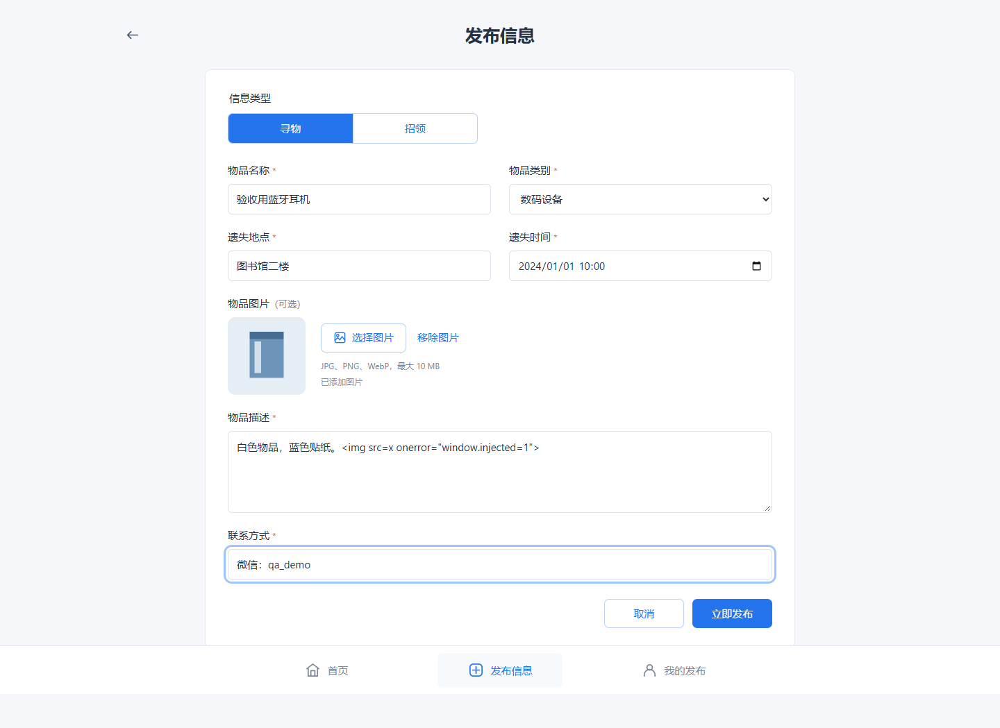
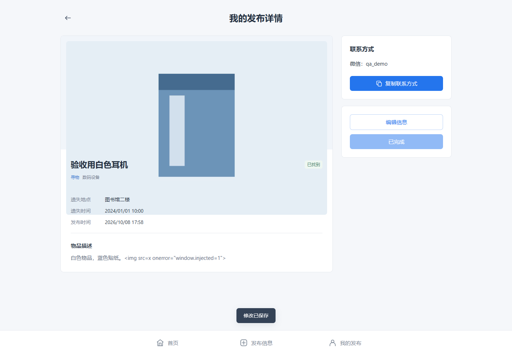
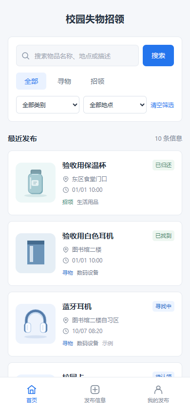
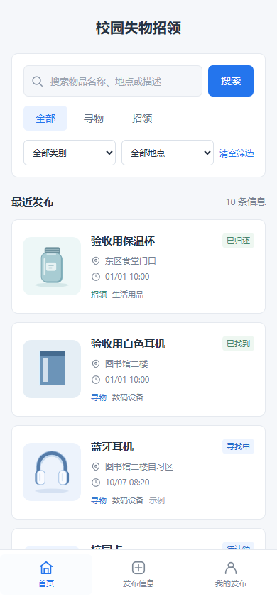

# 测试设计、教程与验收结果

## 测试工具

单元测试采用 Node 内置 `node:test` 与 `node:assert/strict`，不需安装 Jest 等额外框架。业务模块是纯函数，浏览器存储通过参数注入，所以可在 Node 中自动验证。网页入口另用真实 Chrome 和 Playwright 检查，补足 Node 测试无法覆盖的 DOM、导航、布局及 file:// 行为。

入门顺序：阅读 [node:test 文档](https://nodejs.org/api/test.html)，理解 Arrange（准备输入）、Act（调用函数）、Assert（断言结果），先写有意义的失败用例，再完成实现和回归。不是只看页面是否“好像正常”。

```javascript
const test = require('node:test');
const assert = require('node:assert/strict');
const Core = require('../js/core.js');

test('他人不能完成记录', () => {
  const post = { ownerId: '发布者A', status: 'open', type: 'lost' };
  assert.throws(() => Core.resolvePost(post, '用户B'),
    error => error.code === 'FORBIDDEN');
});
```

这个测试验证实际业务拒绝了非发布者操作。若删除归属判断，它就会失败；不是验证模拟对象是否存在。

运行方式（项目根目录）：

```powershell
npm test
npm run test:coverage
```

## 用例构造与白盒方法

题目正文写至少 5 个，附录写至少 10 个。本项目按更严格要求设计，当前 **74 个单元测试全部通过**。

| 模块 | 数量 | 输入与分支 |
|---|---:|---|
| core.js | 38 | 两种发布；六个必填字段缺失；空格；错误类型；非法及未来日期；长度边界；QQ / 微信；搜索各字段；无结果；组合筛选；本人 / 他人；完成、重复完成及编辑后状态；图片保留、移除及非法内容拒绝 |
| storage.js | 18 | 首次初始化、再次加载、持久化往返、状态保留；读取或写入拒绝；损坏 JSON、未知版本、身份缺失、错误状态、重复 ID、对象字段及非法时间戳；旧记录兼容、照片持久化与非法照片不覆盖 |
| ui.js | 9 | HTML 转义、正常及异常路由、查询编码、未知筛选类型；剪贴板成功、拒绝及 API 缺失 |
| images.js | 9 | 三种允许格式、10 MB 边界、空文件及不支持格式；横图、竖图、小图、极窄图与非法尺寸 |

采用**白盒分支测试**：逐一检查校验函数的空值 / 长度 / 时间分支，归属判断的本人 / 他人分支，完成操作的首次 / 重复分支，以及存储的首次 / 已有 / 损坏 / 拒绝分支。同时结合等价类和边界值：正常联系字符串、纯空格、对象输入，名称 61 字超过上限，2 月 30 日与未来时间等。

预期值使用人工确定的字面量，不由被测函数生成。存储测试使用 Map 实现最小 Storage 边界，仅替换 Node 不具备的浏览器 I/O；仍检查真实仓库函数的结果和原始数据是否保留。

### 覆盖率

本次记录见 [原始测试输出](../artifacts/unit-tests.txt)：

| 文件 | 行覆盖率 | 分支覆盖率 |
|---|---:|---:|
| core.js | 99.45% | 91.25% |
| storage.js | 98.80% | 88.89% |
| ui.js | 82.66% | 84.85% |
| images.js | 44.29% | 94.12% |
| 合计 | 86.00% | 89.76% |

这是 **Node 加载的四个模块**的覆盖率，不代表 DOM 页面代码的覆盖率。图片解码、Canvas 压缩、预览、图标及日期展示主要由真实 Chrome 流程检查覆盖；images.js 的 Node 行覆盖率因此较低。覆盖率不能证明所有错误都不存在。

## Chrome 验收

实际结果保存在 [browser-results.json](../artifacts/browser-results.json)。测试使用真实安装的 Google Chrome，不使用放宽本地文件访问的参数。主流程设置为离线模式，入口为 `file://.../index.html`，桌面 1440×1000，窄屏 390×844。

本次运行环境：Windows、Node.js v24.19.0、Google Chrome 154.0.8037.98。新版页面的完整验收记录时间为 2026-10-08 09:58:20（北京时间），后续重新下载验证另行记录。

**29 项检查全部通过，主流程未捕获脚本错误为 0：**

1. Chrome 直接打开 HTML，初始化 8 条示例。
2. 空表单显示字段错误。
3. 未上传照片时默认图片随类别切换。
4. 选择照片生成预览并按比例压缩。
5. 发布寻物并进入真实详情。
6. 用户 HTML 仅显示为文本。
7. 发布者完成寻物，刷新仍为已找到。
8. 编辑已完成信息不重置状态。
9. 非法类型、损坏图片和超大文件不会替换已有照片。
10. 只修改照片也会提醒未保存，放弃后原照片保留。
11. 我的发布仅包含当前浏览器记录。
12. 未保存离开取消后保留表单。
13. 浏览器后退取消后恢复原路由和表单。
14. 关键词与类别地点组合筛选。
15. 无结果有提示并可清空筛选。
16. 招领发布及已归还流程。
17. 剪贴板被拒绝时可人工复制。
18. 我的发布按寻物招领筛选，前进后退保留筛选条件。
19. 编辑可更换照片，完成状态保持。
20. 移除照片后恢复类别插画，刷新仍保持。
21. 390px 窄屏无横向溢出。
22. 图片处理期间取消离开保留表单与待处理图片。
23. 放弃正在处理的图片不会写入下一张新表单。
24. 保存失败保留输入且不进入成功页。
25. 他人详情不提供管理入口，伪造编辑路径被拒绝。
26. 不存在的记录显示恢复入口。
27. 损坏的本地数据不会被初始化覆盖。
28. 浏览器禁用存储时显示明确提示。
29. 浏览器没有未捕获脚本错误。

验收中发现连续取消后退可能使确认弹窗失去按钮事件：复用同一 dialog 时，旧的异步 close 事件影响下一次操作。失败用例复现后，将确认结果在按钮或 Escape 操作时立即完成并清理事件，再验证连续取消、后退和前进全部通过。

测试采用隔离浏览器上下文，不修改日常 Chrome 数据。写入失败、复制拒绝、损坏数据等在隔离上下文中主动构造，以验证正常用户不常遇到的失败分支。该版本只承诺本机流程，不把客户端 ownerId 判断当作线上安全认证。

## 页面截图









## 评价与后续人工检查

测试已覆盖核心成功、失败和状态一致性路径，尤其针对上一轮原型中页面切换后状态恢复的问题。仍应由两位成员用自己的 Chrome 普通窗口下载项目，人工体验键盘操作、长文本、日期输入及实际联系方式复制；这类真实试用反馈不能用自动化结果替代。不同 Chrome 配置、文件路径或浏览器间的 localStorage 不保证共享。
